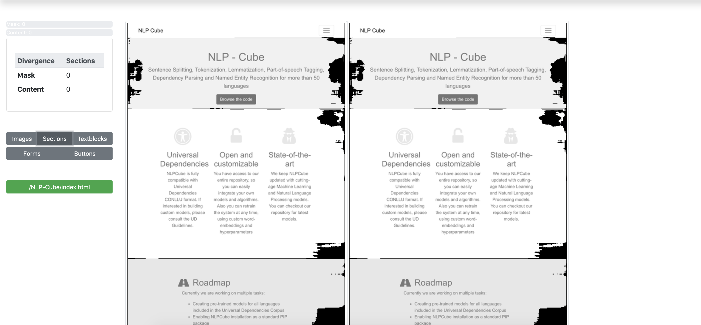

# Frontend-Regression-Validator(FRED)

FRED is an opensource visual regression tool used to compare two instances of a website. FRED is responsible for automatic visual regression testing, with the purpose of ensuring that functionality is not broken on instances that are being upgraded. The main idea is that detecting breaking changes can be achieved through visual comparison of screenshots between a baseline and an upgraded instance of a website.
Using visual regression is a good idea for the “Zero Cost Upgrade” process. Mainly we are only updating/upgrading the underlying framework and we are not pushing any changes to the custom code or content. Thus, FRED expects both instances (the baseline and the upgraded one) to be visually identical.
However, this is not always the case and we draw the attention to dynamic content, which stands for content that can change based on random variables, timers etc. We include here random newsfeeds, commercials and custom designed image-based effects e.g. a carrousel that randomly choses the first image) and many others.

Use FRED if you need:
* Screenshot comparision
* Automatic layout/content verification

More specifically, FRED will report differences regarding the following components of each webpage:
* Images
* Sections
* Forms - text inputs, login forms etc.
* Buttons
* Text

## Setup

### Dependencies and how to run
* Packages in requierments.txt - installed via pip

* [Java JDK](https://www.oracle.com/technetwork/java/javase/downloads/) for starting the proxy server that collects network stats

* [chromedriver](https://chromedriver.chromium.org) (use same release version as chrome)

In order to use this software, simply run:
```
git clone https://github.com/adobe/frontend-regression-validator.git
pip install -r requirements.txt
cd fred/
cd inference/
cat model_files.bz2.parta* > model_files.bz2
tar xjf model_files.bz2
cd ..
export CHROMEDRIVER_PATH=/path/to/chromedriver
python3 run.py
```
This will launch a Flask API server that answers to requests. In order to view the API readme, follow this link https://github.com/adobe/frontend-regression-validator/blob/master/fred/README.md.

### Web UI usage
If you want to view the UI and access the API this way, then navigate to http://localhost:5000/static/submit.html. To use the UI, you have to fill in the forms:

| Fields                          | Explanation                               |
| ------------------------------- | ----------------------------------------- |
| Baseline URL                    | URL of the baseline instance              |
| Updated URL                     | URL of the updated instance               |
| Max depth                       | Max depth to crawl links in the two pages |
| Max URLs                        | Max URLs to save for regression testing   |
| Prefix                          | Prefix to append to output directories    |
| Baseline URL username(optional) | Username for the baseline instance        |
| Baseline URL password(optional) | Password for the baseline instance        |
| Updated URL username(optional)  | Username for the updated instance         |
| Updated URL password(optional)  | Password for the updated instance         |

This will launch a job with an ID. If you navigate to http://localhost:5000/static/jobs.html, you can see the status of the launched job i.e. Done, Failed, In progress. After the job ends, the `View Results` button will become available and you can click it in order to view the results. To interpret the results, see below.

### API usage
In order to use the tool programatically, read the following link https://github.com/adobe/frontend-regression-validator/blob/master/fred/README.md containing the description of the API.

## Results
The results that are gathered after each job is done are the following:
* Screenshots of every endpoint that has been crawled from both instances - `./tmp/{prefix}_baseline/{endpoint_number}.png` and `./tmp/{prefix}_updated/{endpoint_number}.png`, where the name corresponds the endpoint in the JSON report
* Predicted segmentation masks for each of the components specified above - `./tmp/{prefix}_baseline/{component}_{endpoint_number}.png` and `./tmp/{prefix}_baseline/{component}_{endpoint_number}.png`
* Saved Javascript and Network messages - `./tmp/{prefix}_baseline/{endpoint_number}_js_log.json` and `./tmp/{prefix}_baseline/{endpoint_number}_network_log.json` and for updated instance respectively
* A JSON report containing calculated scores

### Scores
The tool reports 2 different scores:
* `mask_div` - the higher, the more different the layout of the two pages is
* `pixelwise_div` - the higher, the more different the content is inside the predicted masks(useful for dynamic content where the layout might stay the same but a different image may be loaded for example)
Both of them are reported per component, but they also contain an average called `overall`, which in the UI is shown in the progress bars on the left.
There are also the network stats and javascript stats scores. These are calculated by taking all the messages that the webpage produces on load and calculating the fraction that is common between both the baseline and the updated instance.
The general risk score is calculated as `max(max(all ui_stats risk scores), max(all network and js stats risk scores))`. The general JS and network stats are the sum of all the JS and network stats in each endpoint. It also reports the mean and the stddev of the above.

## Examples


The website used as an example is https://opensource.adobe.com/NLP-Cube/index.html. We used the same link as both baseline and updated versions due to lack of an example website containing differences. You can see that it segments the components and it delivers the scores on the left. Both scores are 0 since there is no difference in layout, content or network messages. In the top left, you can see the overall score which is also 0 for the same reasons.
